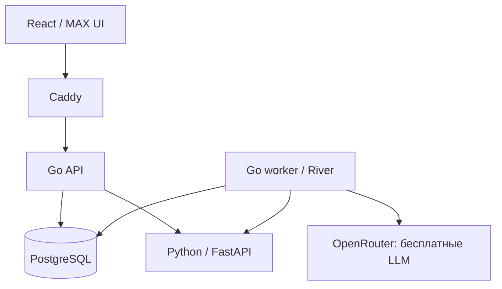

# Архитектура каркаса

## Компоненты

В каркасе стрелки Go → Python проверяют готовность внутреннего API. Передача
документов и применение правил будут следующей реализацией по этому же разделению.
Go → OpenRouter работает через отдельный синтетический probe при наличии API-ключа.
Пользовательский поток проверки документов пока не подключён.

## Go-приложение

API и worker собраны из общего Go-модуля. API обслуживает HTTP-запросы,
worker исполняет задания River. PostgreSQL хранит очередь и данные приложения.
`cmd/migrate` последовательно применяет Goose-миграции и официальные миграции River.

`cmd/probe` ставит задание `system.processor_probe` и ждёт завершения.
Задание вызывает защищённый endpoint Python. Это проверяет очередь и сетевую
связь между контейнерами. Вызов не создаёт пользовательских документов.

`cmd/probe -llm` ставит `system.llm_probe` в очередь `llm` с одной попыткой.
Worker вызывает модуль `semantic`, который отправляет структурированный запрос
через `internal/integrations/llm` и проверяет ответ. API-ключ доступен только worker.
Без ключа внешний запрос не выполняется. Подробнее: [LLM](llm.md).

## Python-сервис

FastAPI проверяет сервисный Bearer-токен и структуру входных метаданных.
Python не имеет доступа к PostgreSQL, постоянному тому документов и токену MAX.
Файлы в будущем передаются байтами из Go worker.

- `extractors`: DOCX и PDF, сохранение исходных фрагментов и координат.
- `ocr`: подготовка страниц и ограниченные по ресурсам процессы распознавания.
- `profiles`: версии схем извлечения полей поддерживаемых бланков.
- `contracts.py`: структуры обмена, которые экспортируются в `contracts/`.

Зависимости python-docx, pdfplumber, pypdfium2, pytesseract и Pillow зафиксированы
в uv.lock. Образ содержит Tesseract и языковые данные русского/английского языков.
Сами алгоритмы ещё не подключены. Отсутствие профилей явно отражено в `/internal/v1/ready`.

## Предметная граница

Python возвращает прочитанные значения, неопределённости и местоположение.
Go сопоставляет их с опубликованными требованиями и создаёт замечания.
Для смысловой части Go обращается к LLM с конкретными требованиями и фрагментами.
Код проверяет структуру ответа и ссылки; правильность интерпретации модели требует
отдельной оценки. LLM не публикует правила и не принимает решения за ведомство.
Оценка OCR не является вероятностью правильности; нечитаемость не считается
доказанным нарушением заявителя. Опубликованные правила и результаты не дублируются в Python.

Будущий запуск фиксирует версии файлов, SHA-256, версию требований и профиль
извлечения. Повтор задания не должен дублировать результат, а удаление комплекта
должно блокировать позднюю запись ответа Python.

## Окружение

Эхо-бот запускается отдельно через `cmd/bot`: пакет `integrations/max` получает
обновления long polling и повторяет входящий текст. `make bot-local` загружает
корневой `.env`, `make bot` запускает Docker-профиль `bot` с отдельной исходящей
сетью `max-egress`. Сервису нужен только `MAX_BOT_TOKEN`, без БД и Python.
Авторизация мини-приложения и обработка документов через MAX ещё не реализованы.

Compose поднимает пять постоянных сервисов: gateway, api, worker,
document-processor и postgres. Миграции — отдельный одноразовый контейнер.
Снаружи доступен только gateway на localhost; Python и БД не публикуют порты.
Для OCR Python получает ограниченные CPU, память и временный каталог.
Worker также подключён к `llm-egress` для исходящих HTTPS-запросов к OpenRouter.
Эта сеть не публикует порты и не является фильтром исходящих доменов.

Все настройки инфраструктуры находятся в окружении. `.env` создаётся локально,
не коммитится; токен MAX добавляется пользователем для запуска бота. Текущие публичные Go-маршруты
возвращают только инфраструктурные статусы. До реализации авторизации маршруты
с пользовательскими документами добавлять нельзя.
